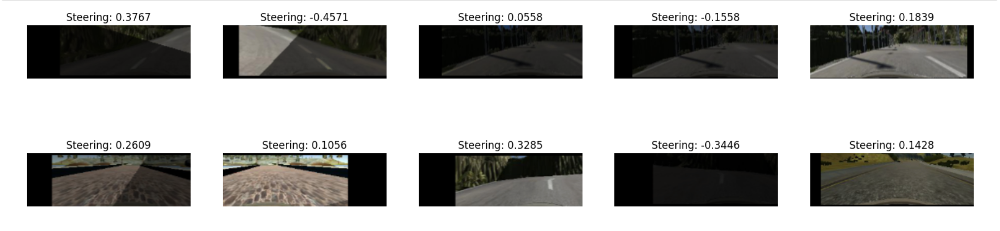

# Project 3 - Behavioral Cloning

### Project Goals
* Use the simulator to collect data of good driving behavior
* Build, a convolution neural network in Keras that predicts steering angles from images
* Train and validate the model with a training and validation set
* Test that the model successfully drives around track one without leaving the road
* Summarize the results with a written report

### File Structure

My project includes the following files:

- model.ipynb(.py) containing the script to create and train the model
- drive.py for driving the car in autonomous mode
- model.h5 containing a trained convolution neural network 
- README.md summarizing the results

### Model Architecture and Training Strategy

#### 1. Appropriate training data

Training data was chosen to keep the vehicle driving on the road. I used a combination of center lane driving (3 loops), recovering from the left and right sides of the road (1 loop), and a smooth driving technique (1 loop), make sure the training was sufficient. 

In addition, rather than recorded the above loops in one time, might cause human errors driving lots of tracks in one time, I combined 2 or more training records in the data loading section so that I can record the above training strategies individually.

```
# load in the data
import pandas as pd

#training set 1
track_log = pd.read_csv('../../Dataset/train/driving_log.csv',names=['Center','Left','Right','Steering Angle','Throttle','Break','Speed'], skiprows=1)

#training set 2
track1_log = pd.read_csv('../../Dataset/test/driving_log.csv',names=['Center','Left','Right','Steering Angle','Throttle','Break','Speed'], skiprows=1)

#combine track1 and track2 data
combine = [track_log, track1_log]
#make the combine ignore the index number
track_log = pd.concat(combine, ignore_index=True) 

print(track_log.shape)
```

#### 2. Data Preprocessing

To make sure the training wasn't overfitted, I had implemented some data augmentation before training. 


- Flipping Images and Steering Measurements

    In order to overcome the imbalance of the steering angle in the dataset, causing the model preferred to right or left turning, I picked the flipped image and steering angle randomly. So the results of turning angle in the model will balance.

	 
```
# flip images horizontally
def random_flip_image(img, angle):
    if np.random.rand() < 0.5:
	    img = cv2.flip(img, 1)
	    angle = -angle
return img, angle
```

- Modify the Brightness and Add Random Shadow

	The dataset was only recorded on single sunning condition, to add more variation on the dataset, modifying the brightness and covering the shadow randomly on the images to simulated day and night condition and let the model worked fine on different weather conditions.


```
def modify_brightness(img):
    img = cv2.cvtColor(img, cv2.COLOR_BGR2HSV)
    brightness_mul = np.random.uniform(low=0.3, high=1.0)
    img[:,:,2] = img[:,:,2]*brightness_mul
    img[:,:,2][img[:,:,2]>255] = 255
    img = cv2.cvtColor(img, cv2.COLOR_HSV2BGR)
    return img
```

	
```
def random_shadow(img):
    img = cv2.cvtColor(img, cv2.COLOR_RGB2HLS)
    
    # (x1, y1) and (x2, y2) forms a line
    # xm, ym gives all the locations of the image
    x1, y1 = 200 * np.random.rand(), 0
    x2, y2 = 200 * np.random.rand(), 66
    xm, ym = np.mgrid[0:66, 0:200]
    
    # create the mask area
    mask = np.zeros_like(img[:, :, 1])
    mask[(ym - y1) * (x2 - x1) - (y2 - y1) * (xm - x1) > 0] = 1

    # choose which side should have shadow and adjust saturation
    cond = mask == np.random.randint(2)
    random_bright = np.random.uniform(low=0.2, high=0.7)

    # adjust Saturation in HLS(Hue, Light, Saturation)
    img[:, :, 1][cond] = img[:, :, 1][cond] * random_bright
    
    img = cv2.cvtColor(img, cv2.COLOR_HLS2RGB)
    return img
```

- Moving the Images Position Randomly

	The original dataset only contained approximately 9000 samples, which was not sufficient amount for deep learning and might cause overfitting easily. Therefore, I randomly moved the images position with same steering angle to make sure the model learned the correct and essential feature rather than memorized the dataset.
	
```
def random_translate(img, angle, range_x=100, range_y=10):
    trans_x = range_x * (np.random.rand() - 0.5)
    trans_y = range_y * (np.random.rand() - 0.5)
    angle += trans_x * 0.002
    trans_m = np.float32([[1, 0, trans_x], [0, 1, trans_y]])
    height, width = img.shape[:2]
    img = cv2.warpAffine(img, trans_m, (width, height))
    return img, angle
```

Here is a visualization of the augmentation result




#### 3. Model architecture 

My model is base on the [NVIDIA paper](https://images.nvidia.com/content/tegra/automotive/images/2016/solutions/pdf/end-to-end-dl-using-px.pdf), including 1 Lambda layer, 5 Conv2D layers, 1 Dropout layer and 4 Dense layers.

Additionally, The model contains dropout layer in order to reduce overfitting (between Conv2D and Flatten, see the code above).

```
INPUT_SHAPE = (66, 200, 3)
DROP_PROB = 0.7

model = Sequential()
model.add(Lambda(lambda x: x/127.5-1.0,input_shape=INPUT_SHAPE))
model.add(Conv2D(24, 5, 5, activation='relu', subsample=(2, 2)))
model.add(Conv2D(36, 5, 5, activation='relu', subsample=(2, 2)))
model.add(Conv2D(48, 5, 5, activation='relu', subsample=(2, 2)))
model.add(Conv2D(64, 3, 3, activation='relu'))
model.add(Conv2D(64, 3, 3, activation='relu'))
model.add(Dropout(DROP_PROB))
model.add(Flatten())
model.add(Dense(100))
model.add(Dense(50))
model.add(Dense(10))
model.add(Dense(1))
```

The model was split into trained and validated samples by using the `sklearn.model_selection` to ensure that the model was not overfitting by only learning on single sample. It was tested by running it through the simulator and ensuring that the vehicle could stay on the track.

```
#split the log into train_samples and validation_samples
from sklearn.model_selection import train_test_split
train_samples, validation_samples = train_test_split(track_log, test_size=0.2)
```

#### 4. Model training

The model used an adam optimizer and the Mean square error (mse) as loss calculation, so the learning rate was not tuned manually.

```
model.compile(optimizer="adam", loss="mse")
```


By using powerful GPU, I trained my model with 32000 samples each epoch, and 10 epochs per time. It took about 3-4 hours to finish the training. 

```
from keras.callbacks import ModelCheckpoint, ReduceLROnPlateau, LambdaCallback, Callback
import keras

# compile and train the model using the generator function


for time in range(10):
    train_generator = generator(train_samples, 64)
    validation_generator = generator(validation_samples, 64)
    
    history_object = model.fit_generator(
                           train_generator, 
                           samples_per_epoch=32000,
	                       validation_data=validation_generator,
                           nb_val_samples=len(validation_samples),
                           nb_epoch=10,
                           verbose=2,
                           callbacks=[
                  ModelCheckpoint(filepath="time"+str(time)+".h5", verbose=1, save_best_only=True),
                  keras.callbacks.TensorBoard(log_dir='./Graph', histogram_freq=0, write_graph=True, write_images=True)
                                        ])
    
    print('Time ',time+1)
```

### Results

Here are the the results and performance of my model in the track 1, click the link below to see the simulation video: 
[Simulation on Track 1] (https://youtu.be/dCODaYC2NGc)

### Acknowledgements

Thanks to lots of developer who had already took the class and shared their implementation online. They gave me really much great idea on the data augmentation and training strategies. Here are my reference sources:

- [llSourcell](https://github.com/llSourcell/How_to_simulate_a_self_driving_car)
- [mvpcom](https://github.com/mvpcom/Udacity-CarND-Project-3)
- [cacheop](https://github.com/cacheop/CARND-AllTerms-projects/tree/master/CARND-Term1-projects/P3_CarND-Behavioral-Cloning)

Also wanna thanks Siraj Raval who made a Youtube video introducing the whole process of how to build a basic Self-Driving model. Here are the video link: [How to Simulate a Self-Driving Car](https://www.youtube.com/watch?v=EaY5QiZwSP4&feature=youtu.be)


