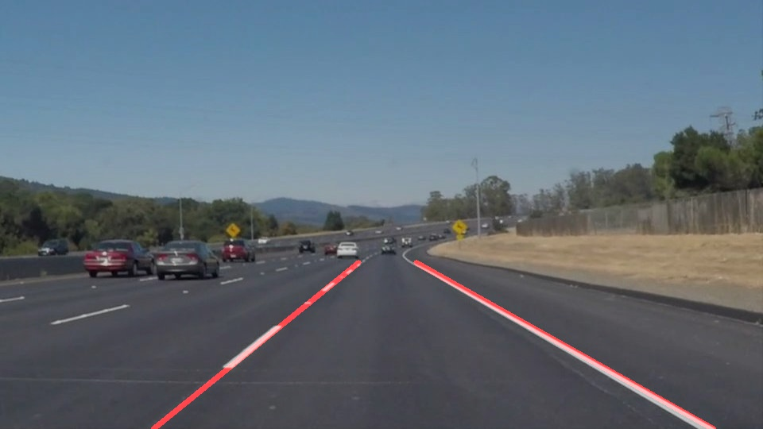

# Project 1 - Finding Lane Lines on the Road Basic
[](http://www.udacity.com/drive)



The goal of this first project was to **create a simple line to detect road lines** in a frame taken from a roof-mounted camera.

just use computer vision to detect lines
## Step
```
image process
1. convert image to gray
2. GaussianBlur process to the image
3. detect image of interest and put into masked_edges
4. use HoughLinesP to detect lines
5. redetect lines in masked_edges
6. weighted original image and draw lines on it
```
