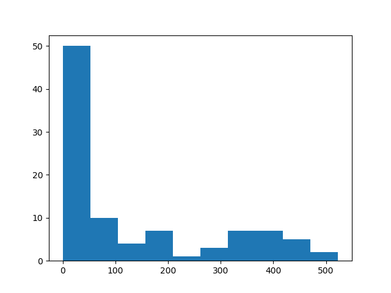
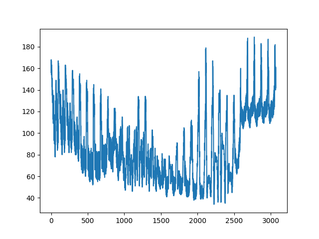
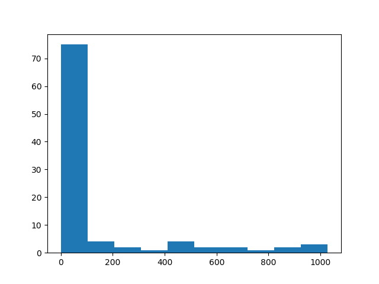
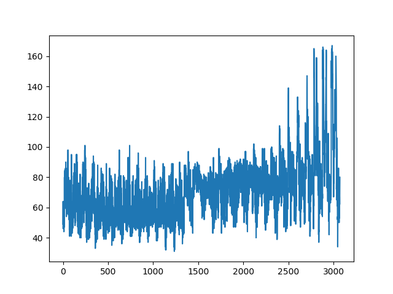
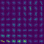
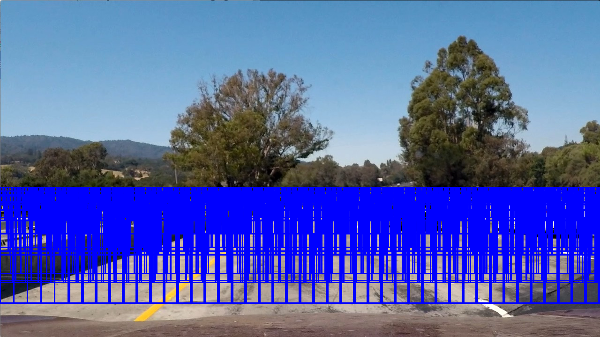
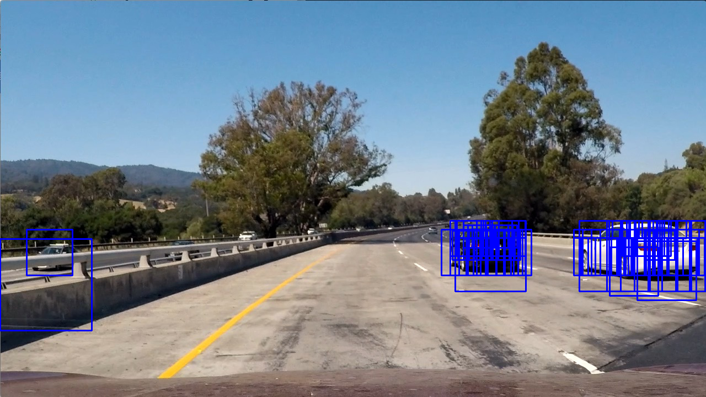
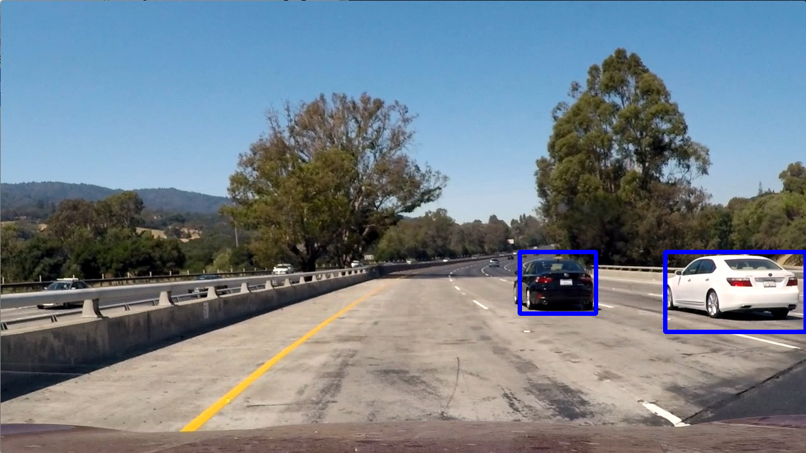

# CarND-Vehicle-Detection

### Histogram of Oriented Gradients (HOG)

#### 1.Extracting Features
  In this project,features should imformative enough to distinguish between the *car* and the *non-car*.
  
  To make sure that all the fuction for feature extraction work properly, I first use two random-selected pictures in training dataset
  to extract the features for *car* and *not-car*.Here are the image for the test result:
<table style="width:100%">
    <th>
      <p align="center">
        
        <br>Car image for test
      </p>
    </th>
    <th>
      <p align="center">
        
        <br>Color Histogram feature image
      </p>
    </th>
    <th>
      <p align="center">
        
        <br>Spatial feature image
      </p>
    </th>
    <th>
      <p align="center">
        
        <br>HOG feature image
      </p>
     </th>
  </table>
<table style="width:100%">
    <th>
      <p align="center">
        
        <br>Not-Car image for test
      </p>
    </th>
    <th>
      <p align="center">
        
        <br>Color Histogram feature image
      </p>
    </th>
    <th>
      <p align="center">
        
        <br>Spatial feature image
      </p>
    </th>
    <th>
      <p align="center">
        
        <br>HOG feature image
      </p>
     </th>
  </table>
  The most of the code for feature extraction is contained in [`get_featue.py`](get_featue.py),which includes `bin_saptial` function,
  `color_hist` function, and  `get_hog_feature` function to get the color histogram ,spatial feature, and HOG feature respectively.The 
  first two feature are for object's appearance and the third feature is for object's shape.
  
  However, the actual process for feature extraction is performed by the function `single_img_features`,which takes only one input   
  image and a set of parameters from [`parameters.py`](parameters.py), then return the feature analyzed for the image. To extract 
  features for a list of image,  extract_features will iterate the image list and return a list of features, one for each image.
  
#### 2.Setting Parameters
  In order to select the proper parameter to enhance validation accuracy, I have tried many combinations of the parameters, it's a 
  little bit hard. After tuning many times, I found that YCrCb color space is more reliable than the others,it make the validation 
  accuracy to 0.99.
  Althouth the use of all hog channel and the big spatial and hist bins really slow my pipeline process, it's in acceptable range based 
  on traing acuracy.Following is the paremeters in the [`parameters.py`](parameters.py), which will be accessed anywhere in this 
  project:
  ```
  #the parameters will be used in features extraction 
  params = {	'color_space' : 'YCrCb' , 	# Can be RGB, HSV, LUV, HLS, YUV, YCrCb
			'spatial_size' : (32, 32),	# Spatial binning dimensions
			'hist_bins' : 32, 			# Number of histogram bins
			'hist_range' : (0, 256),	# The range of Histogram
			'orient' : 9, 				# HOG orientations
			'pix_per_cell' : 8, 		# HOG pixels per cell
			'cell_per_block' : 2, 		# HOG cells per block
			'hog_channel' : 'ALL',		# Can be 0, 1, 2, or "ALL"
			'spatial_feat' : True, 		# Spatial features on or off
			'hist_feat' : True,			# Histogram features on or off
			'hog_feat' : True,			# HOG features on or off
			'y_start_stop' : (400, 650)	# Min and max in y-axis to search sliding windows  
      }
  ```
  
#### 3.Training Classifier
  We have decided the feature fuction and the parameters will be used. Now, get the features from the dataset. Remember to define the
  sample size ensure the sample *balance*:
  ```
  #Define the sample size to ensure the data balance
	sample_size=8600
	cars = cars[0:sample_size]
	notcars = notcars [0:sample_size]
  
  #	Get car features
	car_features = extract_features(cars, color_space, spatial_size , hist_bins, 
						orient, pix_per_cell, cell_per_block, 
	                    hog_channel, spatial_feat, hist_feat, hog_feat)
	
	#	Get not car features
	notcar_features = extract_features(notcars, color_space, spatial_size , hist_bins, 
						orient, pix_per_cell, cell_per_block, 
	                    hog_channel, spatial_feat, hist_feat, hog_feat)
  
  ```
  We should standardize the feature vaector to have all feature in similiar range, enhancing reliability:
  ```
  # Create an array stack of feature vectors
	X = np.vstack((car_features, notcar_features)).astype(np.float64)
	# Fit a per-column scaler
	X_scaler = StandardScaler().fit(X)
	# Apply the scaler to X
	X__scaler = X_scaler.transform(X)
  ```
  Then, training the SVM and test the accuracy by `svc.score`:
  ```
  # Use a linear SVC 
	svc = LinearSVC()
	svc.fit(X_train, y_train)
  ```
  These process are all contained in [`train.py`](train.py).
### Sliding Window Search
#### 1.Describe how (and identify where in your code) you implemented a sliding window search. How did you decide what scales to search and how much to overlap windows?
  First, I created set of windows of different scale and stiched them together to get a window list, this is for the perpose of  
  different scale of classification for the car. But some cars in such a simple grid seems too small, some cars only be captured portion 
  of feature.
  
  Second, I have a implementation that increase the window size in every iteration of a row, and increase the overlap of windows. After   attempt, I can frame the car accurately, but it has many false positive and slow my detection process.
  
  Last, I apply the threshold and heat map method, it really reduce the false positive but still in catastrophy.I have tried many times   to take the different parameter combination,it still have many false positive in my detection process if I want to have accurate 
  detection of vehicle
  
  The pipeline process is implemented in [`search_classify.py`](search_classify.py)
#### 2.Show some examples of test images to demonstrate how your pipeline is working. How did you optimize the performance of your classifier?
  The pipeline process is implemented in [`pipeline.py`](pipeline.py), actually process by the function `pipeline_subprocess`, which includes feature extraction, searching, classification and display the result. Following is the example images that show the initial sliding window, serch window, heatmap and the result image which apply the threshold method:
  <table style="width:100%">
    <th>
      <p align="center">
        
        <br>Initial Sliding Windows
      </p>
    </th>
    <th>
      <p align="center">
        
        <br>Hot Windows
      </p>
    </th>
  </table>
   <table style="width:100%">
    <th>
      <p align="center">
        
        <br>Heatmap
      </p>
     </th>
     <th>
      <p align="center">
        
        <br>Result image with thresholded heatmap
      </p>
     </th>
  </table>
  
### Video Implementation
#### 1.Provide a link to your final video output. 
  Here's a [link for my old version ouput] (https://youtu.be/6B31eLtrz1U)
  
  Here's a [link for my latest version ouput] (https://youtu.be/eDZFAXYNzBg), upload on 2018/3/13
#### 2.Describe how (and identify where in your code) you implemented some kind of filter for false positives and some method for combining overlapping bounding boxes.
  I use the heatmap  to get detection result from the test image, and threslod the heatmap to reduce most of the false positive.
  The method is shown above of second point on the title slide window search.
  
  Evaluate the image without caching my heatmap,causing the unstability of my video processing.Hence, I use the following two method:
 	
##### 1.collections.deque
  Ues the ```collections.deque``` to caching the previous frame, and increase the threshold to a reliable number.The result video seems
  stabler than before, but still have some false positive.
  ```
  def cache_heat_deque(heatmap, box_deque):
	
	for bbox_list in box_deque:
		for box in bbox_list:
		# Add += 1 for all pixels inside each bbox
		# Assuming each "box" takes the form ((x1, y1), (x2, y2))
			heatmap[box[0][1]:box[1][1], box[0][0]:box[1][0]] += 1
		
	# Return updated heatmap
	return heatmap
  ```
	 
  It is implemented in [`search_classify.py`](search_classify.py)
 
#####   2.hard negative mining
 I collected the window image which is predicted to be positive, then pick the fasle detection window adding to the non-vehicle
	training data and balance the sample size. The Training accuracy is also 0.99. This process really reduce the false positive of
	my detection.
 
### Disscussion
#### Briefly discuss any problems / issues you faced in your implementation of this project. Where will your pipeline likely fail? What could you do to make it more robust?
  In this project, I get frustrated on the parameter tuning. This is a little  tricker for me. Even now, I can't get the satisfying 
  result which remove all false positive and keep the detection window.
  
