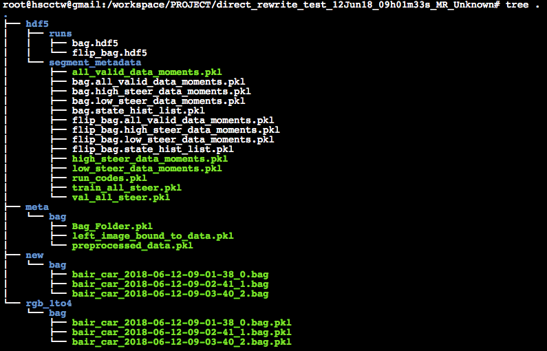

# Runing Deep Leaning Model

## First thing first

### Setting up the Desktop environment with ros (see ros/) and make sure you're using ubuntu with GUI, and using python2 to run

## File Structure
1. libs/ -- contain some essential util code
2. logs/ -- record the log data during training, you have to set the current directory in files of training/
3. nets/ -- The SqueezeNet network
4. preprocesses/ -- preprocesses the bag file record on Car
5. training/ -- training the preprocesses data
6. Parameters.py -- Make sure you review this file before training

## Trainng Flow
1. Make sure Parameters.py are setting well
2. Use preprocesses/preprocess.py to process the bag files
3. Use preprocesses/segment_h5py.py to generate the training set and validating set (will open up opencv to analysis bag records)
4. Use training/Train.py tp train the model (it's better to move out files of training/ to fix the module missing issue)

## Notes
### 1. If any interruption comes up, check with the path setting of every .py files first.

### 2. Here is the sample files structure of bag records. First you have to mkdir /new/bag/ with all original bag file in it. Second preprocess.py will generate meta/ and rgb_1to4. Then the segment_h5py.py will generate hdf5/ for training.

